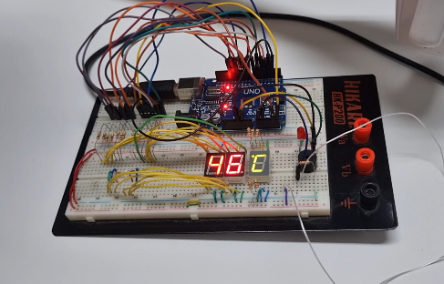

# Thermalmeter

This is a project for Embeeded Systems Grade from University

Materials:
- WZP-PT100, to get temperature from air or fluid
- Buzzer, to bip when temperature is too high
- 3 seven segments displays, to display the current temperature

## Breadboard assembly

## Participants
- [Ádrian Gama](https://gitlab.com/jusqua)
- [Breno Murilo](https://github.com/breno505)